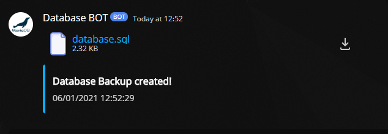
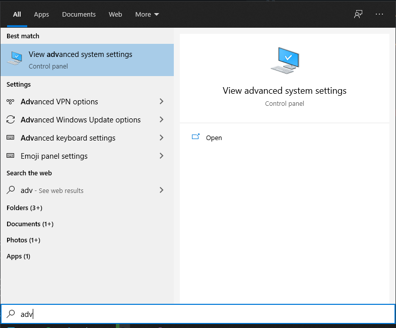
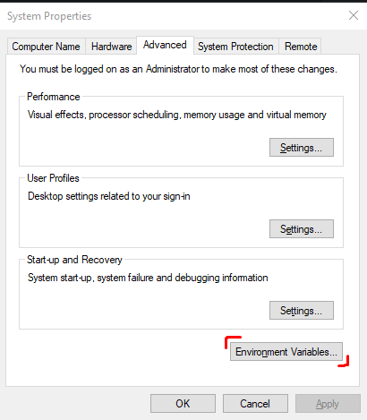
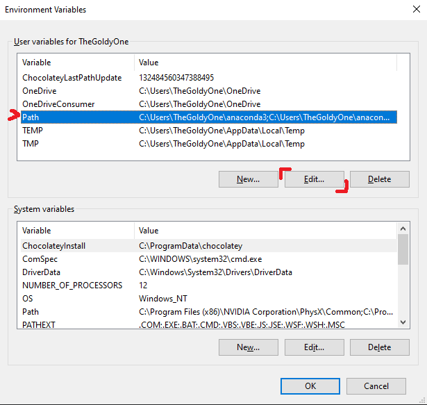
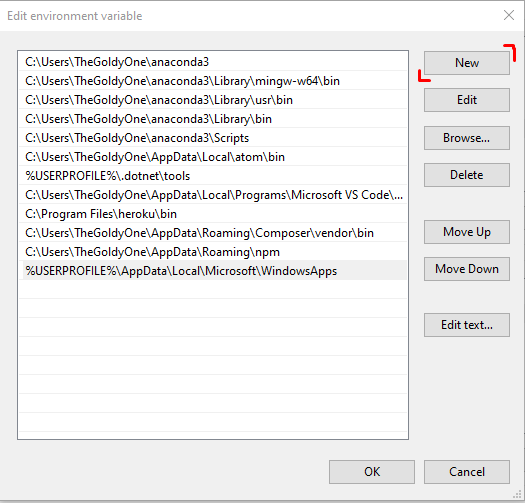
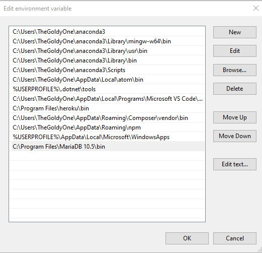

## Table of contents

- [General info](#general-info)
- [Technologies](#technologies)
- [Dependencies](#dependencies)
- [Setup](#setup)
- [.Py to .Exe](#.Py-to-.Exe)
- [Adding MySQL to Windows PATH](#Adding-MySQL-to-Windows-PATH)

## General info

This program makes MySQL Database Backup and sends it to Discord channel via webhook

to make this program work you have to add MySQL `bin` folder to your Windows PATH, see [Adding MySQL to Windows PATH](#Adding-MySQL-to-Windows-PATH)

## Technologies

Project is created with:

- Python 3.X

## Dependencies:

- os
- datetime
- discord_webhook

## Setup

First you need to edit `Main.py` file:

replace `YOUR_WEBHOOK` with discord webhook link</br>
replace `YOUR_DATABASE_USERNAME` with database username</br>
replace `YOUR_DATABASE_PASSWORD` with database password</br>
replace `YOUR_DATABASE_NAME` with name of your database</br></br>

Then head to the console:

```console
$ pip install discord_webhook
```

```console
$ python main.py
```



## .Py to .Exe

```console
$ pip install pyinstaller
```

```console
$ pyinstaller --onefile main.py
```

Your .exe file is located in `/dist/` folder

## Adding MySQL to Windows PATH

open `View advanced system settings`



next to `Environment Variables`



Select `Path` and click `Edit`



Click `New`



Then paste your MySQL bin folder location


